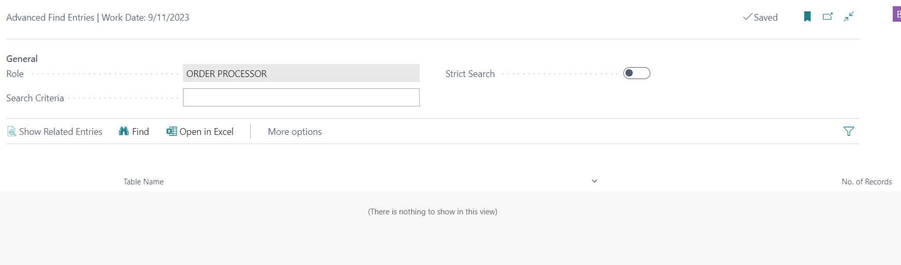
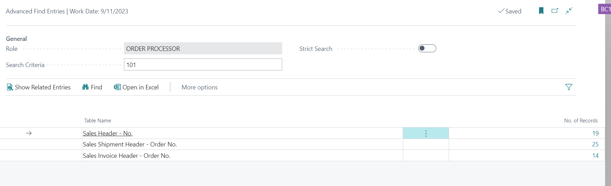
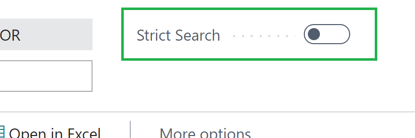
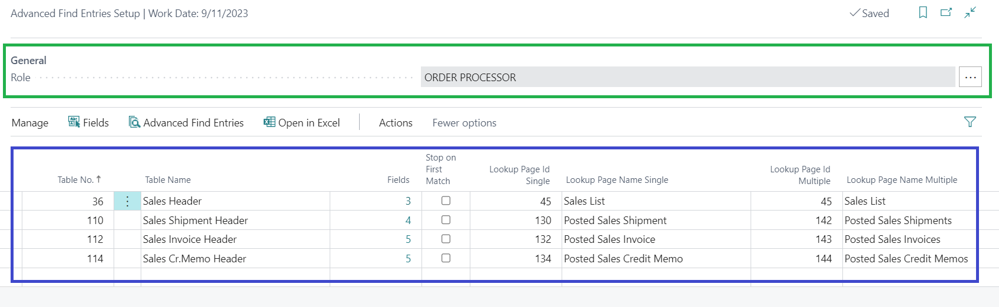
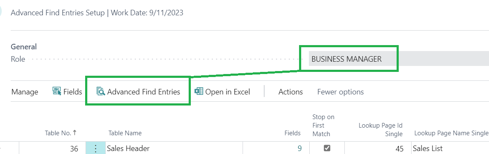
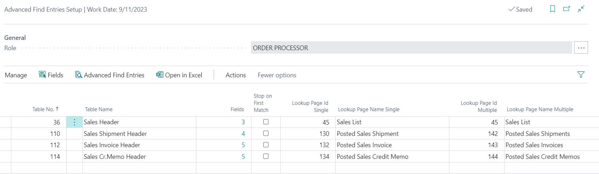
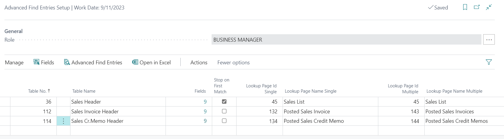
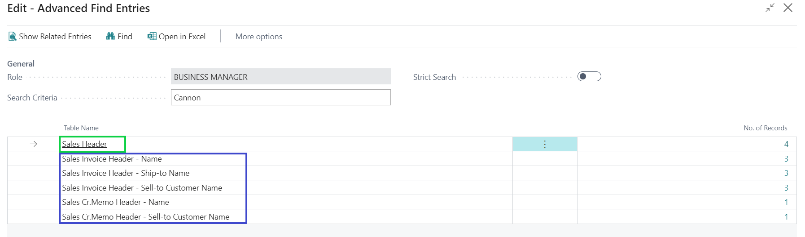
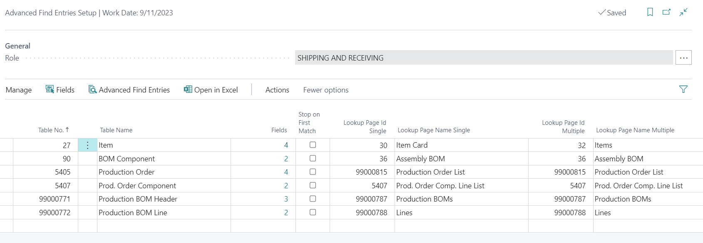

# The Challenge
Whenever I train new users in Business Central, the Customer Service team always comes up with the very same question:

_"If a customer calls to inquire about their order status, how can I look that information up?"_ 🕵️‍♀️

 <!--more-->
And you know, in Business Central, we **do** need to look that up in at least 2 different places: _Sales Orders_ and _Posted Sales Invoices_. No matter the different ways you can look this information up, fact is, that if you can't find the Sales Order in the Sales Order list, you must look it up on the Posted Sales Invoices to ensure that it's there.

... anyway, very often, right after my short explanation, I get the same reaction:

_"Do I have to look in 2 different places??"_ 🦥

Well, after having been asked this same question so many times, and knowing that Business Central has a pretty powerful programming language, I decided to submit an [idea](https://experience.dynamics.com/ideas/idea/?ideaid=173910b8-fdae-ea11-8b71-0003ff68f609) to Microsoft, that would be some sort of **Advanced Navigate** (back when **Find Entries** was called **Navigate**). Unfortunately, my idea didn't get enough push to be noted by Microsoft.

Therefore, I decided to pursue this challenge myself. I went ahead and developed the **Advanced Find Entries**

# How It Works
To start, make sure you're currently setup under the **Order Processor** role, and search for **Advanced Find Entries** on the Search Bar. Don't forget to add a bookmark!

To start searching, just type anything (e.g. a Sales Order No.) on the **Search Criteria** field, and click **Find** on the Actions ribbon.

Just like standard **Find Entries**, BC will show a list of Tables that contains the **Search Criteria**, including in which _Fields_ the content was found. You can also drill down into the No. of Records, just like standard **Find Entries**.

The **Strict Search** flag is just a convenience feature: If set, **Advanced Find Entries** will only look for the exact **Search Criteria**. If not, it will search for the **Search Criteria** in any part of the field (this is the equivalent of applying a filter with '*' in the beginning and end of a filter).

Let's see a few more details on what you can accomplish with **Advanced Find Entries** on the following sections...

# Setup
To setup the **Advanced Find Entries**, search for **Advanced Find Entries Setup** on the Search Bar.

On the General area, marked in green, you can select which Profile you want to setup. On my first demo above, I ran a search over the **Order Processor** profile. I also provide demo data for the **Business Manager** and **Inventory Manager** Roles.

On the lines area, marked in blue, you will select which tables and fields you want the **Advanced Find Entries** to search on. On the setup above, for the **Order Processor** profile, I setup tables **Sales Header** (which includes *Quotes*, *Orders*, *Invoices*, *Credit Memos* and *Return Orders*), **Posted Shipments**, **Posted Invoices** and **Posted Credit Memos**.

Here's a brief description on how you can setup each field on the lines:
* **Table No.**: The Table No. for the Table you want to setup. Use the **Page Inspection** to help with that information, if you don't know Table Nos. by heart.

* **Fields**: For each table, you must setup which fields the search engine will search over. If no fields are specified, the Table will be completely ignored. To setup fields, you can either drill down from the line, or click on **Fields** from the Actions ribbon.

* **Stop on First Match**: Flag this if you want **Advanced Find Entries** to stop the search over a table once it finds the **Search Criteria** in any of the fields setup for that table. **❗Note**: If your searches are taking too long to execute, you may want to set this flag for the tables with most records.
-- For an example on this field, refer to [Use Case 2 - Business Manager](#Use-Case-2-Business-Manager). 

* **Lookup Page Id Single**: Determine which Page Id that should open when you drill down into the **No. of Records**, when only 1 record is found. This is a nice feature to take the user straight into a Card, as opposed to taking the user to a List.

* **Lookup Page Id Multiple**: The opposite from **Lookup Page Id Single**, you should specify here the Page Id that supports a List for this table.

Once everything is setup, you can test it by running the **Advanced Find Entries** action from the Actions ribbon. This will open the **Advanced Find Entries** page for the role that you are currently setting up. This is specially helpful when you're setting up a Role that is different that the one you're currently assigned to.

Keep reading to see a few applications of the **Advanced Find Entries**

# Use Case 1 - Sales Order Processor

On the Sales **Order Processor** role, we are more focused on _Documents Numbers_. Therefore, when customers call to inquire about their order, or maybe about a shipment or an invoice they received, it's valuable for Customer Sales Reps to be able to search by the reference number that the customer has on hand.

With this in mind, I setup the Order Processor role to search mainly on fields that can contain Document Nos.:
* **Sales Header**
  - No.
  - Your Reference
  - External Document No.
* **Posted Sales Shipments**
  - No.
  - Customer PO No.
  - Order No.
  - External Document No.
* **Posted Sales Invoices**
  - No.
  - Customer PO No.
  - Order No.
  - External Document No.
  - Pre-Assigned No.
* **Posted Sales Cr. Memos**
  - No.
  - Customer PO No.
  - External Document No.
  - Pre-Assigned No.
  - Return Order No.

# Use Case 2 - Business Manager

A **Business Manager** might be more interested in researching documents related to _Customer Names_, rather than _Document Numbers_. Therefore, I setup this profile to focus on the **Sales Orders**, **Posted Invoices** and **Posted Credit Memos**, and to search over fields that usually contain Names (Customer Names and Contact Names).

For this, I added the following 9 fields to tables **Sales Header**, **Posted Sales Invoice** and **Posted Credit Memo**:
* Name
* Name 2
* Contact
* Ship-to Name
* Ship-to Name 2
* Ship-to Contact
* Bill-to Name
* Bill-to Name 2
* Bill-to Contact

Note that for table **Sales Header**, I have flag **Stop on First Match** turned on. For this table, BC will start searching for the **Search Criteria** on the first field (sorted by Field No.), and once it finds any records matching the criteria, it will no longer search for that on the other fields, and, the Search Results will simply display the Table Name as a hit.

When this flag is turned off (which is the default), even if BC finds records in a table, for one specific field, it will still keep on searching in the same table for the subsequent fields. Also, on the Search Results, it will display the specific Table Name and Field Name where records were found.

See the example below, when I search for **Cannon** on a BC Demo Database:

In green, you can see that BC found 4 records containing the criteria **Cannon** in the Sales Header table, however, it is not clear in which field it was found. For this Use Case, knowing the field is not important.

In blue, you can see that BC found multiple records, but because **Stop on First Match** was turned off, BC kept on searching multiple times over the same table, looking for different fields, and indeed, it found **Cannon** over 3 different fields on Sales Invoice Header table, and over 2 different fields on the Sales Credit Memo table.

⭐ **Tip** ⭐: Turn **Stop on First Match** on to increase performance when searching on tables with a large number of records.

# Use Case 3 - Inventory Manager

The Inventory Manager has more of an Item-centric search need. They are interested in finding out where an Item No. is currently used. Therefore, I added quite a few tables that can reference an Item No., and more than that, I also included Description fields on the search, so that the Inventory Manager can lookup items either by its Number, or by its Description.

As an example, check out the results that show up when I search for the good old "Wheel":

As an improvement to this profile, you could add fields from the Sales Lines, Purchase Lines, maybe Transfer Lines, and etc.

# Conclusion

That's it for today. I hope you enjoy the first extension I'm making available on this website.🍻