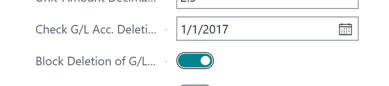
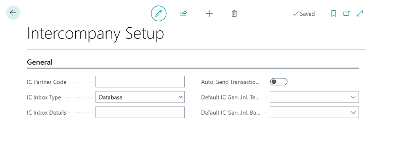
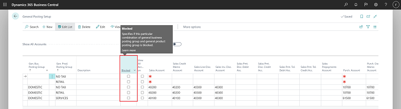
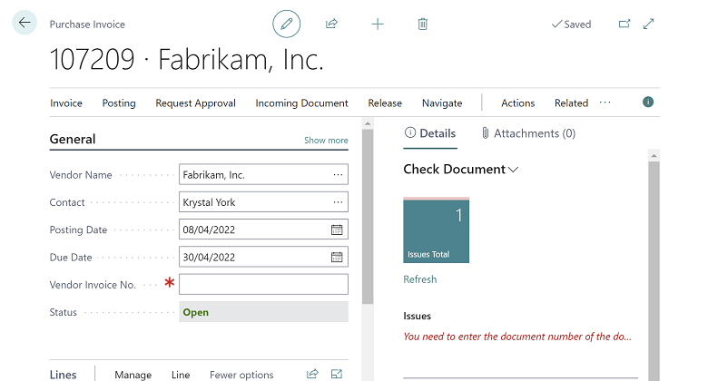
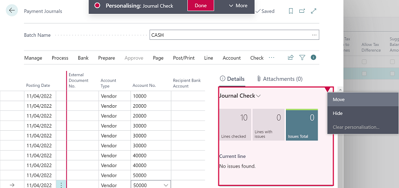
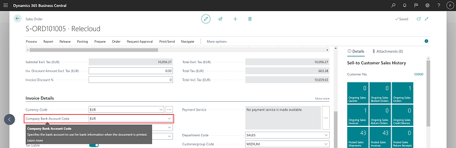
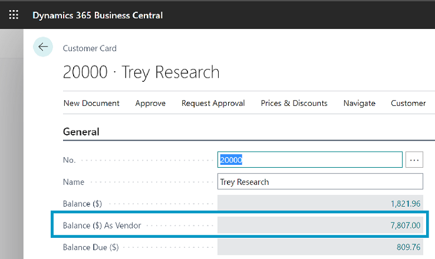
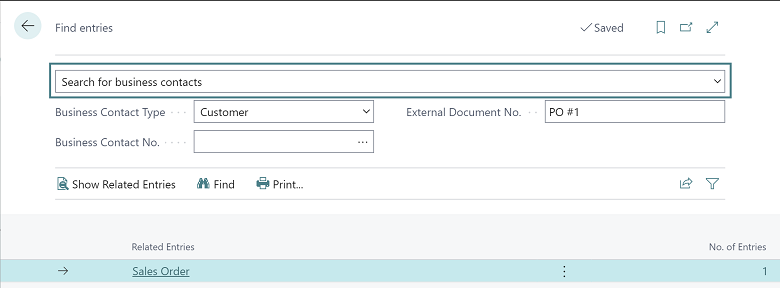
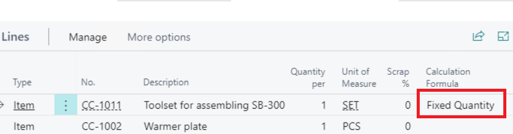
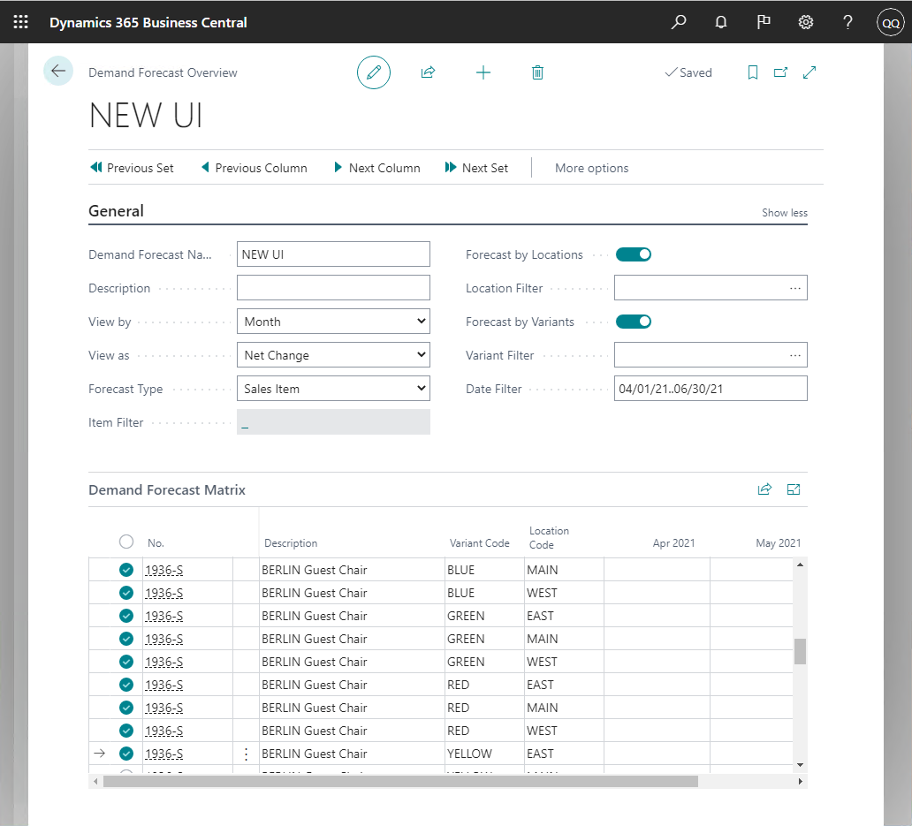

Another April is coming, and Microsoft is getting all ready to deploy the 2022 Wave 1 Release for their whole Dynamics 365 family of products. For us, this means only one thing: 🟦**BC 20**🟦 **is here!** 🎉🎊🎈
<!--more-->

These major upgrades usually get a lot of content, because they affect multiple areas that support the whole Business Central ecosystem. Not only we get tons of Functional (Application) upgrades, but we also get upgrades on Power Apps, Power Automate, Power BI, BC integration with Office 365, BC integration with Teams, the AL Language itself, and a quite a few tools for IT admins to manage this whole engine. ⚙

On this post, I'm going to be focusing more and highlighting some of the Functional (Application) upgrades coming to this version. **Tip**: On each section, you can click on that section's title to go right into the Microsoft documentation for that feature.

---
# (G/L) [Blocking Deletion of G/L Accounts](https://docs.microsoft.com/en-us/dynamics365-release-plan/2022wave1/smb/dynamics365-business-central/blocking-deletion-gl-accounts)
A while ago, Microsoft introduced a field on the General Ledger Setup, called **Check G/L Acc. Deletion After**, that, upon trying to delete a G/L Account, if that account had entries after that date, BC would ask if the user really wanted to delete that G/L Account. This is pretty useful for those countries that have a retention policy over the number of Years that some data must be stored. However, like many things in BC, this setting was not bullet proof: users could simply confirm they wanted to delete (maybe by mistake, whooops 😢), and then BC would delete the account. 💫

Now, BC is introducing a flag (**Block Deletion of G/L Accounts**) that, when turned on, will hard-block the deletion of such G/L Accounts. If the deletion is really needed, an admin, or any other user with access to the **General Ledger Setup** will be able to turn that off, proceed with the deletion, and turn that back on:

---
# (G/L) [Auto-accept transactions for intercompany journals](https://docs.microsoft.com/en-us/dynamics365-release-plan/2022wave1/smb/dynamics365-business-central/intercompany-postings-have-auto-accept-transaction-enabled-intercompany-general-journals)
For those who use Intercompany Transactions, you understand the pain in having to click a thousand times to be able to send and receive documents and general journal lines between the different companies.

Well, after a bit over 3 years (with the BC idea having been submitted in November 2018), Microsoft heard your pains, and they are revamping the Intercompany Experience. Now, just like Purchase and Sales documents, Journal Lines will be able to be automatically accepted on the recipient company.

🔺**Note**🔺: This feature requires that you turn on a new Feature on the Feature Management. As stated on Microsoft's documentation, if you don't enable this new feature, you will see two search results for **Intercompany Setup**, *temporarily* until BC 23 (2023 Wave 2) 😲, when this feature is supposed to kick in automatically.

On the new **Intercompany Setup** you will be able to setup a default **Journal Template** and **Journal Batch** for these transactions.

---

# (G/L) [Block VAT and General Posting Setups](https://docs.microsoft.com/en-us/dynamics365-release-plan/2022wave1/smb/dynamics365-business-central/block-vat-general-posting-setups)
Now it will be possible to post VAT Posting Setups and General Posting Setups!! 🎉

If you block a Posting Setup, guess what happens: Users can't post using that Posting Setup! 😎

This way, you'll be able to keep some old/non-relevant posting setups for history purposes, and still prevent users from using it.

---

# (G/L | Order Processing) [Check documents and journals in while you work](https://docs.microsoft.com/en-us/dynamics365-release-plan/2022wave1/smb/dynamics365-business-central/check-documents-journals-background)
This is another exciting new feature that I can see as a promising solution to the eternal war between Order Processors and Warehouse, when Warehouse is ready to ship, and when they try to post, **boom** 💥 there's some data issue with the Sales Order.

Enabling this new feature **Feature: Check documents and journals while you work** will allow users to get "early, unobstrusive visual indicators that there is a problem" on Documents and Journal Lines, as you work on them.

This is more or less how it's going to look like on Documents (note the new FactBox **Check Document**):

And Journals (note the new FactBox **Journal Check**):

---
# (G/L) [Use different G/L accounts for payables and receivables transactions](https://docs.microsoft.com/en-us/dynamics365-release-plan/2022wave1/smb/dynamics365-business-central/use-different-gl-accounts-payables-receivables-transactions)
🟡 **Late comer** 🟡: *this feature is not being delivered in **April**. Instead, this will be delivered in **June**, 2022*

BC will now allow you to enter different Customer/Vendor Posting Groups on Journals and Documents, based on some Substitution restriction: You need to setup ahead of time which **Substitutes** are valid for each Posting Group, and then users can only pick groups that are eligible as **Substitutes**.

This is a nice feature, and who knows in the future we will have something similar for **Gen. Bus. Posting Groups** and **Gen. Prod. Posting Groups**? 😉

---
# (Finance | Warehouse) [Set default dimensions on locations](https://docs.microsoft.com/en-us/dynamics365-release-plan/2022wave1/smb/dynamics365-business-central/set-default-dimensions-locations)
**Dimensions**... on.... **Locations**! 🍾🍾🍾🍾🍾

---
# (Finance) [Create bank deposits](https://docs.microsoft.com/en-us/dynamics365-release-plan/2022wave1/smb/dynamics365-business-central/bank-deposits)
I have to confess this was a little puzzling to me at first, because **Deposits** have been a thing in the North American version of Navision and Business Central for quite a while, that I even forgot this was **only** available on the NA version. So, why would this be a "new" feature? 😵  (US/CA/MX readers keep reading for 2 important notes on this! -- **Lump sum posting** and **how data will be migrated to new tables**)

Well, I'm glad to hear this has been promoted to a global level, because this is a pretty nice feature for Finance users. **Bank Deposits** make it easier to keep track of those lump-sum transactions that usually comes on Bank Statements as *"Deposit"* and nobody knows what-on-earth is inside that one big payment. Of course, finance users have found different ways of dealing with this, using the different journals available in BC, maybe some companies in some other countries even created ISVs for this (I don't know, do you?), but now, you will have a better way of handling deposits.

In a nutshell, Deposits have a document structure (with header and lines), so that you can enter general information on the header (such as **Bank Account No.**, **Total Deposit Amount**, **Posting Date** and **Dimensions**), and then identify on the lines, which documents are part of such deposit. Such lines can be checks from customers, cash sales revenues, or refunds from vendors. Prior to posting a deposit, the total amount on the lines must match the total deposit amount on the header.

One feature that is new from the NA Version, is the **Post as Lump Sum** : **** Check what this does *****
**** Check how historical NA Deposits data will translate into new global BC Deposits ****

---
# (Finance) [Standardizing the bank reconciliation process in North American versions](https://docs.microsoft.com/en-us/dynamics365-release-plan/2022wave1/smb/dynamics365-business-central/standardizing-bank-reconciliation-process-north-american-versions)
This goes side by side with the previous section on Deposits. Microsoft will now push that North American users migrate to the standard Bank Reconciliation by BC 22 (2023 Wave 1). They claim this functionality has been improved to add features that existed only in the NA version, and, NA users will still have access to their old NA-style bank reconciliations.

NA, keep an eye! 👁👁

---
# (Finance) [Change default company bank account on sales and service documents](https://docs.microsoft.com/en-us/dynamics365-release-plan/2022wave1/smb/dynamics365-business-central/change-default-company-bank-account-sales-service-documents)
Another exciting feature, it will now be possible to setup which Bank Instructions to print on Sales (and Service) documents.

This means, that we no longer will need a report modification to show the differnt banking account information that the customer may have.

With this modification, it will be possible to assign one default **Bank Account** per currency, and when **Sales Orders** are created, the **Company Bank Account Code** field will be automatically filled in based on the currency:

This information transfer to the Posted Sales Invoice, and it will be possible for users to edit this in case they selected the wrong one at Sales Order level.

Microsoft mentions that the printed documents were modified as well, but I haven't had a chance to test myself to see how they're looking. 🤞

---
# (Finance) [Consolidate customer and vendor balances](https://docs.microsoft.com/en-us/dynamics365-release-plan/2022wave1/smb/dynamics365-business-central/consolidate-customer-vendor-balances)
Yes, you are reading this right: BC will now have some **light** functionality to help AP and AR talk better when it comes to Vendors-that-are-also-Customers or Customers-that-are-also-Vendors.

For this to work, you need to setup a Customer as a Vendor (or the Vendor as a Customer), using the standard **Contact Management** functions that have existed in BC and NAV for quite a while. (*Quick guide*: Go to the customer contact, select the Contact for the Company, **Functions** | **Create as** | **Vendor** (or **Customer** as needed)).

When this is setup, then you will see 1 new field on your Customer Card (and 1 on the Vendor Card):

Lastly, on the Payment Journals, you will get a new action **Net Customer/Vendor Balances** that automatically create netting lines for Customers and Vendors that are linked.

---
# (Finance) [Improved and extensible Adjust Exchange Rates batch job](https://docs.microsoft.com/en-us/dynamics365-release-plan/2022wave1/smb/dynamics365-business-central/improved-extensible-adjust-exchange-rates-batch-job)
Not much on my daily routine, but it seems they are improving the **Adjust Exchange Rates** job in 2 new ways:
* Possibility to preview the effect of the adjustments prior to posting
* Possibility to determine how Dimensions will be assigned to Gains and Losses exchange adjustments G/L entries:
  - Use dimensions from source entry
  - Use dimensions from (Gains and Losses) G/L accounts
  - Do not use dimensions

---
# (All Areas) [Finding documents and entries efficiently](https://docs.microsoft.com/en-us/dynamics365-release-plan/2022wave1/smb/dynamics365-business-central/finding-documents-entries-efficiently)
Well, it seems Microsoft tried improving the basic **Find Entries** functionality, and it seems they will make a global shortcut now so that you can run the **Find Entries** page from anywhere you are in the system. This is pretty cool! It seems they are also improving the main page to include 3 types of searches:
* **Documents**
* **Business Contacts**
* **Item References**

I don't know exactly how broad the search will now be, so, let's see after it gets rolled out.

In the meantime, maybe you should check one of our repository items: [Advanced Find Entries](/2022/03/16/Advanced-Find-Entries/). It does what the Find Entries does, and a bit more. I'll maybe even consider taking over that new Global Shortcut 😆, who knows!

---
# (Manufacturing) [Fixed Quantity in product bills of materials](https://docs.microsoft.com/en-us/dynamics365-release-plan/2022wave1/smb/dynamics365-business-central/fixed-quantity-product-bills-materials)
It will now be possible to assign a BOM Component with a Fixed Quantity, independent on how many items will be output!! 🎉

This will allow for Product Designers to include packaging and random-variable material on the Production BOM Components.

This improvement will be delivered throught a new option on field **Calculation Formula**: *Fixed Quantity*

When **Calculation Formula** is *Fixed*, the Production BOM Component Lines will calculate **Quantity** = **Quantity per**

---
# (Manufacturing) [Demo tool and demo data for manufacturing scenarios](https://docs.microsoft.com/en-us/dynamics365-release-plan/2022wave1/smb/dynamics365-business-central/demo-tool-demo-data-manufacturing-scenarios)
Microsoft will be bringing back demo data of the Manufacturing module, as an extension. It's not clear to me if they will install this by default with 🟦**BC 20**🟦, or if you need to download this Extension separately from the the product media (DVD) download.

**Questioning Microsoft on this**

---
# (Demand Planning) [New UI for entering demand forecasts to add support for variant code and other improvements](https://docs.microsoft.com/en-us/dynamics365-release-plan/2022wave1/smb/dynamics365-business-central/new-ui-entering-demand-forecasts-add-support-variant-code-other-improvements)
In demand planning, now you can:
* **Not only Filter** the Demand View, **but also enter** Forecast **per Variant**
  - This will show the same item multiple times, one for each variant 😲
* **Enter Forecast per Location**
  - This will show the same item multipel times, one for each location!! And it CAN be used in conjunction with the one for Variants 😲😲😲
* **Store** Date, Location and Item **filters, as well as the Forecast Type**, so that you can close the page and open again at later point, and just pick up from where you left off 😲😲😲😲😲

---
# (Jobs) [Allow the sell-to and bill-to customers to be different for jobs](https://docs.microsoft.com/en-us/dynamics365-release-plan/2022wave1/smb/dynamics365-business-central/allow-sell-to-bill-to-customers-be-different-jobs)
I usually don't work with the Jobs module, to be honest, but this one sounds like an exciting new feature.

Just like the regular Sales Order structure, BC will now have a **Sell-to** and a **Ship-to** customer information together with the **Bill-to** customer information that already existed. This will allow the project manager to route invoicing and the rendering of services accordingly. This will probably make life easier, if your Jobs are entered in BC way before they actually take place. PMs will no longer need to keep memory of these details, they will just be able to enter directly on the Job details.

Last, but not least, 4 very important fields have also been added: **Your Reference**, **External Document No.**, **Payment Terms Code**, and **Payment Method Code**.

---
# (Jobs | Warehousing) [Support inventory pick and warehouse pick operations for jobs](https://docs.microsoft.com/en-us/dynamics365-release-plan/2022wave1/smb/dynamics365-business-central/support-inventory-pick-warehouse-pick-operations-jobs)
Again, Jobs is not much of my area, but I know there had been some ISV's in the market that did exactly this: Provide Inventory support to the Jobs Module.

Now, 🟦**BC 20**🟦 will be bringing Inventory Pick and Warehouse Pick operations into Jobs.

---
# (Plugins) [Shopify connector](https://docs.microsoft.com/en-us/dynamics365-release-plan/2022wave1/smb/dynamics365-business-central/shopify-connector)
Sounds promising, but I would be wary of this in the beginning. I'm sure there will be thousands of wrinkles (or maybe some huge creases 😕), to be ironed out with time.

---
# (Job Queues) [Delegated admin’s job queue entries are run by user](https://docs.microsoft.com/en-us/dynamics365-release-plan/2022wave1/smb/dynamics365-business-central/delegated-admin-create-job-queue-entries-request-approval-licensed-user)
It shouldn't be this hard, but delegate accounts (aka Partner Accounts) still cannot run Job Queue Entries, however, Microsoft improved it a little bit, and now delegate users can create a Job Queue Entries, and request that a real licensed user runs it.

I'm curious on how it's going to look like, but it sounds a bit better than what we have today. 🤞

---
# (Reports) [Excel Layouts](https://docs.microsoft.com/en-us/dynamics365-release-plan/2022wave1/smb/dynamics365-business-central/users-use-excel-design-layouts-reports)
This one also looks like a very nice feature: **Excel Layouts**.

Just like **Word Layouts**, you will be able to create custom **Excel Layouts**, to add all the bells and whistles to it, such as sliders, diagrams, charts, pivot tables, etc. Then you will be able to import this layout back into Business Central, and see magic happens next time you export your repor to Excel.

There are no screenshots to entice us on the documentation for this feature, so, right now, I'll just be trying to picture it in my mind 😁💭

---
# (Telemetry) [Error dialogs are logged to telemetry](https://docs.microsoft.com/en-us/dynamics365-release-plan/2022wave1/smb/dynamics365-business-central/telemetry-error-dialogs-are-logged-telemetry)
This is a bit of a technical topic, but I am very excited about this one.

Now, when users get an Error message (logged with an **AL ERROR** function), admins will be able to review the telemetry entries to find where errors were triggered. This will help a lot of developers and ISV companies better assist users having **mysterious** error messages.

Please note that this will **not** log error messages that are not really ERROR messages: If the program triggering the error message is actually triggering an **AL MESSAGE** function, you will still have some hard time assisting with debugging.

---
Well, that's it. I'm wrapping up here my review on the features that I wanted to highlight on the **major release of** 🟦**BC 20**🟦. It's not always that Microsoft has this many new exciting features, to be honest, but this release seems to be a very good one 🤩.

There are quite a few other improvements coming on this release that I did not add to my list, either because they were too technical, or because they were just minor to me. Therefore, please make sure to review the original Microsoft [Release Plan](https://docs.microsoft.com/en-us/dynamics365-release-plan/2022wave1/smb/) if you want to know every single new thing coming on 🟦**BC 20**🟦. 🍻